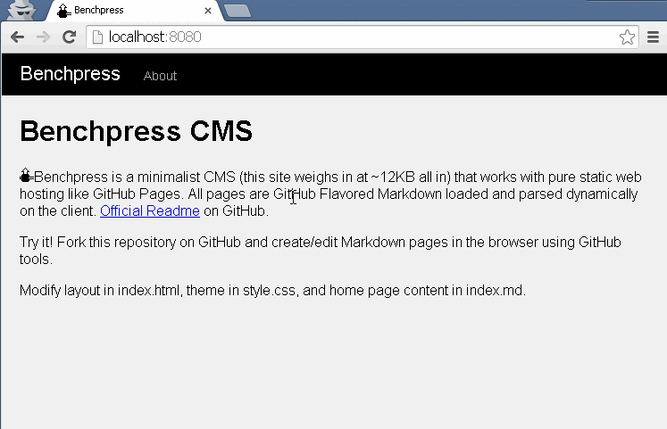

# Benchpress CMS

Benchpress is a minimalist CMS (this site weighs in at ~12KB all in) that works with pure static web hosting like GitHub Pages. All pages are GitHub Flavored Markdown loaded and parsed dynamically on the client. View [Benchpress](https://srpeck.github.io/benchpress/) in action.

Try it! Fork this repository on GitHub and create/edit Markdown pages in the browser using GitHub tools.

Modify layout in index.html, theme in style.css, and home page content in index.md. 

## About
Benchpress is a single page application, so the Markdown conversion ships with /, and further pages are loaded through client-side routing and AJAX.

## Features
- Write in [GitHub Flavored Markdown](https://help.github.com/articles/github-flavored-markdown/), use #hash links for internal links
- Minimal:
    - Page layout and navigation in index.html
    - Theme in style.css
- Simple workflow:
    1. Push index.html, style.css, and index.md to any static web hosting provider (e.g., GitHub Pages)
    2. Edit Markdown files locally and upload, or edit directly on the host (e.g., using GitHub Pages 'Create new file here'/'Edit this file' in-browser editor)

